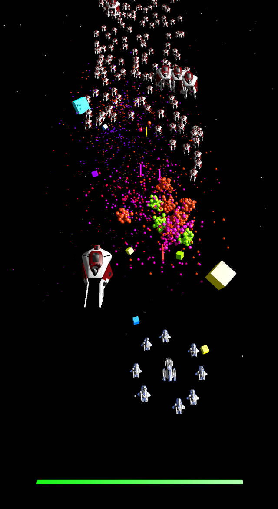

# Arete Examples

A collection of demos and examples for [Arete Engine](https://github.com/aretegames/arete-engine).

If you just want to try out the demos, head over to the [releases page](https://github.com/aretegames/arete-examples/releases) for ready-to-run versions of the demos!

## Setup

To run from code, download the latest version of [Arete](https://github.com/aretegames/arete-engine/releases/tag/v0.1.0) and extract it so that your directory structure looks like:

- `arete-examples/`
    - `arete/` - from the engine zip
    - `arete-cpp/` - from the engine zip (**optional**, for C++ examples)
    - `arete-ios/` - from the engine zip (**optional**, for iOS)
    - `space-cpp/`
    - `tanks-cpp/`
    - `tanks-rust/`

You may now choose any project directory, such as `space-cpp/`, and execute the `run-*` script file to build and run the example!

## Examples

### Tanks

### Space

